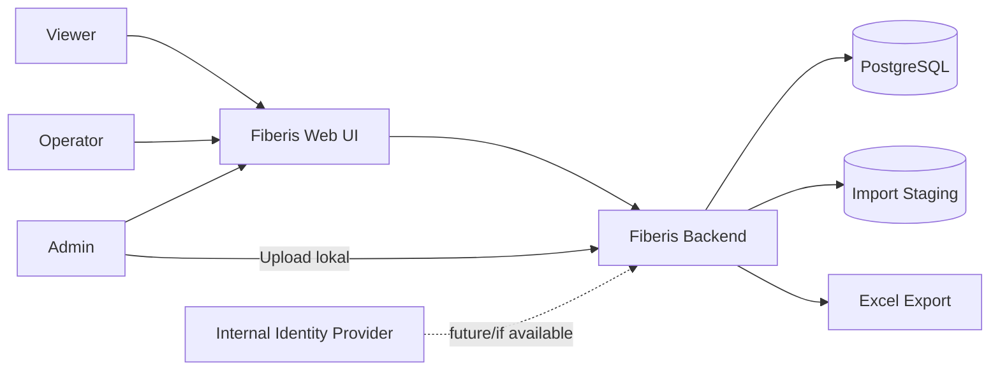
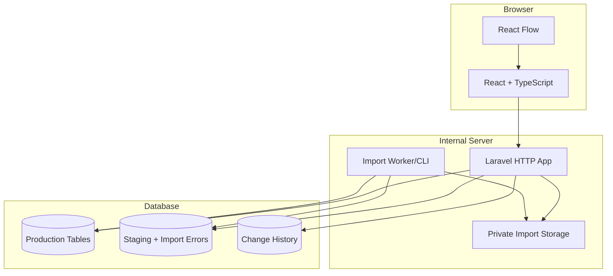

# Fiberis — Application Architecture

**Status:** PROPOSED, menunggu audit data dan konfirmasi kemampuan tim.

## 1. Prinsip

- Modular monolith, bukan microservices.
- Database relasional sebagai source of truth.
- Browser tidak menerima workbook mentah.
- Semua write penting melewati backend.
- Change Over atomic dan fail closed.
- Import dipisahkan dari tabel production melalui staging.
- Graph adalah projection dari data relasional, bukan graph database pada MVP.

## 2. Rekomendasi Stack

| Layer | Pilihan | Alasan |
|---|---|---|
| Frontend | React + TypeScript | UI pencarian, tabel, form, dan graph kuat; type safety |
| Visualization | React Flow | Cocok untuk path terpilih dan node interaktif; hindari canvas custom |
| Backend | Laravel | Delivery cepat untuk proyek magang; auth, validation, queue, transaction, migration matang |
| Database | PostgreSQL | Constraint, transaction, locking, recursive CTE, JSONB staging metadata |
| File processing | Backend job/CLI internal | Data tetap lokal; proses import dapat diulang dan diaudit |
| Deployment | Satu web app + satu DB internal | Operasi dan maintenance paling kecil |

Laravel berstatus **PROVISIONAL**. Jika organisasi sudah memiliki standar Java dan mentor Spring Boot, gunakan Spring Boot; interface dan model data tidak berubah.

## 3. Context Diagram



## 4. Container Architecture



Worker terpisah hanya diperlukan bila import melebihi timeout HTTP. Awali dengan command/job dalam aplikasi sama.

## 5. Backend Modules

| Module | Interface utama | Tanggung jawab |
|---|---|---|
| Identity | login/current user/authorization | Authentication dan RBAC |
| Catalog | search/get detail | Device, location, cable, route, core |
| Path | resolve path/get visualization | Traversal dan projection node-edge |
| Core Allocation | list/check availability | Status dan konflik penggunaan core |
| Incident | create/update/resolve/list impacted resources | Gangguan perangkat, congestion control, FO cut, status, dan dampak |
| Change Over | preview/commit | Validasi, concurrency control, atomic mutation, history |
| Import | inspect/validate/publish/report | Staging pipeline dan error report |
| Export | request/download | Export data terotorisasi |

Jangan membuat interface/adapter tambahan sebelum ada dua implementasi nyata.

## 6. Request Flow — Change Over

```mermaid
sequenceDiagram
    actor O as Operator
    participant UI as Web UI
    participant API as Backend
    participant DB as PostgreSQL

    O->>UI: Pilih impacted path dan protection core
    UI->>API: POST /change-overs/preview
    API->>DB: Read current assignments + version
    DB-->>API: Current state
    API-->>UI: Validation + preview token/version
    O->>UI: Confirm + reason
    UI->>API: POST /change-overs
    API->>DB: BEGIN; lock relevant rows
    API->>DB: Revalidate authorization, status, endpoints, conflicts
    alt Valid
      API->>DB: Update assignment + insert immutable history
      API->>DB: COMMIT
      API-->>UI: Success + change-over ID
    else Invalid or stale
      API->>DB: ROLLBACK
      API-->>UI: Conflict/validation errors
    end
```

## 7. Deployment

### MVP

- satu internal reverse proxy;
- satu backend deployment yang menyajikan API dan static frontend;
- satu PostgreSQL instance;
- private persistent storage untuk import/export sementara;
- backup terjadwal dengan restore test;
- TLS dan network access control internal.

### Tidak Dibutuhkan pada MVP

- Kubernetes;
- microservices;
- event broker;
- graph database;
- distributed cache;
- data lake.

Tambahkan hanya setelah bottleneck terukur atau kebutuhan operasional nyata.

## 8. Security Architecture

- session cookie `HttpOnly`, `Secure`, `SameSite` bila auth lokal;
- CSRF protection untuk cookie-based session;
- server-side RBAC pada setiap operation;
- rate limit login dan endpoint mahal;
- upload allowlist `.xlsx`, size limit, generated storage name;
- workbook disimpan di private storage dan dihapus menurut retention policy;
- export memakai short-lived authorization dan private download;
- audit event append-only dari aplikasi;
- database account aplikasi tanpa privilege schema-admin;
- secret tidak masuk repository;
- dependency dan image scanning pada CI.

## 9. Observability

- health/readiness endpoint;
- structured application log tanpa cell values mentah;
- correlation ID;
- metric import duration/error count;
- metric Change Over attempt/success/conflict;
- alert untuk repeated import failure, DB unavailable, dan backup failure.

## 10. Architecture Fitness Checks

- perubahan Change Over gagal total saat validation/concurrency gagal;
- frontend tidak dapat bypass authorization;
- import invalid tidak menyentuh production;
- path dapat direkonstruksi dari relational records;
- deployment dapat dipulihkan dari backup yang diuji;
- semua fitur MVP dapat berjalan tanpa external API.
