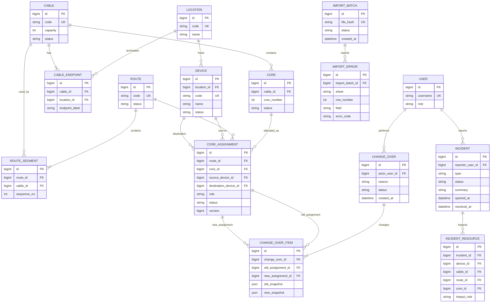
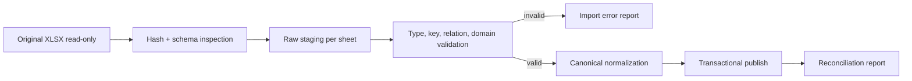

# Fiberis — System Design

**Status:** PROPOSED
**Peringatan:** Entitas dan field di bawah adalah model minimum calon. Audit workbook dapat menghapus, mengganti nama, atau mengubah relasi.

## 1. Batas Fakta dan Asumsi

### Fakta dari rancangan

- aplikasi internal;
- source awal berupa Data Pemakaian Core dan Dapot Transport dalam workbook Excel;
- targetnya database terpusat dengan pembaruan melalui dashboard;
- gangguan mencakup perangkat, congestion control, dan kabel FO cut;
- fokus: search, incident, path, core, Change Over, history, export;
- Change Over harus mencegah konflik dan memakai transaction;
- tiga role minimum: Admin, Operator, Viewer.

### Fakta audit struktural

Hasil audit faktual bersifat internal dan disimpan lokal. Repository publik hanya mencatat bahwa workbook perlu audit struktur, relasi, duplikasi, status, dan candidate key sebelum schema disetujui.

### Belum terverifikasi

- authoritative sheet untuk setiap keluarga data;
- composite natural key yang stabil;
- makna final route, ruas, kabel, core, splice, dan protection;
- cardinality relasi;
- status lifecycle dan availability rule;
- volume data kanonis setelah backup/copy/duplicate dikeluarkan;
- pola concurrent usage.

## 2. Model Konseptual Minimum



`INCIDENT_RESOURCE` memakai nullable FK untuk device, cable, route, dan core dengan check constraint bahwa tepat satu FK terisi. Bentuk ini menjaga referential integrity tanpa tabel polymorphic.

`SPLICE` tetap konsep PROPOSED. Bentuk tabel serta continuity rule ditunda sampai authoritative source dan key dikonfirmasi; jangan menebak relasi dari nama sheet.

## 3. Constraint Minimum

Diverifikasi ulang setelah audit:

- `location.code`, `device.code`, `cable.code`, `route.code` unique bila benar-benar stabil;
- `core(cable_id, core_number)` unique;
- `route_segment(route_id, sequence_no)` unique;
- kapasitas kabel positif;
- core number positif dan tidak melebihi kapasitas bila numbering berurutan;
- satu core tidak boleh memiliki lebih dari satu assignment `ACTIVE` pada scope yang sama;
- old dan new assignment Change Over tidak identik;
- history Change Over tidak boleh dihapus dari aplikasi.

PostgreSQL partial unique index dapat menjaga single active assignment bila status model sudah dikonfirmasi.

## 4. Status Model

Status final berasal dari workbook/domain owner. Proposal minimum:

- Core: `AVAILABLE`, `IN_USE`, `RESERVED`, `FAULTY`, `UNKNOWN`.
- Assignment: `ACTIVE`, `INACTIVE`.
- Route: `ACTIVE`, `PROTECTION`, `IMPACTED`, `INACTIVE`, `UNKNOWN`.
- Change Over: `COMMITTED`, `REJECTED`, `FAILED`.
- Import: `UPLOADED`, `VALIDATING`, `INVALID`, `READY`, `PUBLISHED`, `FAILED`.

`UNKNOWN` wajib fail closed: tidak boleh dipilih untuk Change Over.

## 5. Change Over Validation Rules

Sebelum preview dan diulang saat commit:

1. actor berstatus aktif dan memiliki permission;
2. impacted assignment masih `ACTIVE` dan versinya sama;
3. target core ada dan berada pada cable/route yang valid;
4. target core berstatus `AVAILABLE` menurut rule yang disetujui;
5. target core tidak punya active assignment lain;
6. source dan destination kompatibel;
7. continuity route/segment/splice lengkap;
8. kapasitas dan nomor core valid;
9. target bukan bagian dari resource terdampak;
10. protection route berbeda dari active route bila domain mengharuskan;
11. tidak ada import/pemeliharaan yang mengunci resource terkait;
12. alasan terisi dan lolos batas panjang/karakter;
13. semua referenced record belum dihapus/dinonaktifkan;
14. preview belum stale.

Failure mengembalikan code stabil, field/resource terkait, dan pesan aman. Commit gagal bila satu rule gagal.

## 6. Transaction Design

Urutan commit:

1. mulai transaction;
2. lock assignment/core terkait dalam urutan ID konsisten;
3. baca ulang state dan version;
4. jalankan seluruh rule;
5. nonaktifkan assignment lama;
6. aktifkan/buat assignment baru;
7. perbarui status turunan yang diperlukan;
8. simpan `change_over` dan snapshot item;
9. commit;
10. kirim response setelah commit.

Gunakan database constraint sebagai pertahanan terakhir terhadap double allocation. Tidak ada side effect eksternal dalam transaction MVP.

## 7. Interface HTTP Minimum

Prefix contoh: `/api/v1`.

| Method | Path | Role | Fungsi |
|---|---|---|---|
| POST | `/auth/login` | Public/internal | Login jika SSO belum tersedia |
| POST | `/auth/logout` | Authenticated | Logout |
| GET | `/search?q=&type=` | Semua | Unified search |
| GET | `/devices/{id}` | Semua | Detail device |
| GET | `/routes/{id}/path` | Semua | Node-edge dan table projection |
| GET | `/cores?cable_id=&status=` | Semua | Core usage |
| POST | `/change-overs/preview` | Operator/Admin | Preview + validation |
| POST | `/change-overs` | Operator/Admin | Atomic commit |
| GET | `/change-overs/{id}` | Berizin | Detail history |
| GET | `/change-overs` | Berizin | History terfilter |
| POST | `/imports` | Admin | Buat import batch |
| GET | `/imports/{id}` | Admin | Status dan summary |
| POST | `/imports/{id}/publish` | Admin | Publish validated batch |
| GET | `/exports` | Berizin | Generate/download export |

Request/response detail ditulis setelah data dictionary dan identifier final tersedia. Hindari endpoint CRUD generik yang belum diperlukan.

## 8. Path Representation

Backend mengembalikan dua projection dari query sama:

```json
{
  "path_id": "synthetic-example",
  "version": 1,
  "nodes": [],
  "edges": [],
  "steps": [],
  "warnings": []
}
```

`nodes/edges` untuk graph; `steps` untuk tabel dan accessibility. Jangan menyertakan data nyata pada fixture atau dokumentasi.

Traversal MVP memakai relational query dan urutan segment. Recursive CTE hanya bila struktur nyata bercabang. Graph database ditunda sampai kebutuhan traversal kompleks terukur.

## 9. Excel Migration Pipeline



### Staging

- simpan `import_batch_id`, sheet, row number, raw payload, normalized payload, validation status;
- payload sensitif hanya di DB/private storage dengan akses Admin;
- error report memakai field dan error code; nilai mentah hanya bila kebijakan mengizinkan.

### Publish

- file hash mencegah accidental duplicate import;
- publish repeatable dan memakai transaction;
- unresolved reference memblokir record terkait;
- tidak ada silent coercion atau silent drop;
- reconciliation mencatat source count, valid, invalid, inserted, updated, unchanged.

## 10. Search Design

Mulai dengan PostgreSQL indexes dan normalized columns. Jangan tambah Elasticsearch.

- exact/prefix search pada code;
- case-insensitive search pada nama;
- filter type/status;
- pagination wajib;
- index dipilih setelah profiling volume dan query nyata.

## 11. Export Design

- export dibangkitkan server-side dari data berizin;
- kolom mengikuti template yang disetujui;
- formula tidak diperlukan kecuali kebutuhan bisnis nyata;
- file private dan punya expiry;
- setiap export besar dicatat actor, filter, waktu, dan row count.

## 12. Failure Modes

| Failure | Perilaku |
|---|---|
| Workbook schema berubah | Import ditolak dengan schema diff |
| Invalid foreign reference | Row dikarantina dan dilaporkan |
| Concurrent Change Over | Salah satu transaction mendapat conflict; tidak partial |
| Unknown core status | Tidak selectable |
| Graph path terputus | Tampilkan partial path + warning, blok Change Over |
| Export gagal | Tidak meninggalkan public/partial file |
| History insert gagal | Seluruh Change Over rollback |

## 13. Test Strategy

- unit: normalization dan validation rules;
- database integration: constraints, locks, rollback;
- import fixture sintetis: valid, duplicate, orphan, formula, merged header;
- authorization matrix per endpoint;
- API contract untuk preview/commit;
- frontend accessibility dan critical workflow;
- end-to-end kabel putus sampai history;
- backup/restore smoke test.

Data test selalu sintetis.
